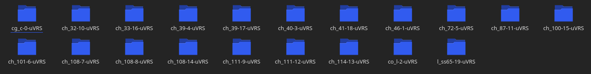
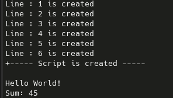

# Folder Sec

## Encode
this script will generate the dir architecture of the code. 
exemple of encoded dir: 

## Decrypt
this script will interpret & execute the hidden code 
exemple of execution: 

# Exemple
i do not want to write LOONNGGG readme for this creepy project, so just run the exemple !
